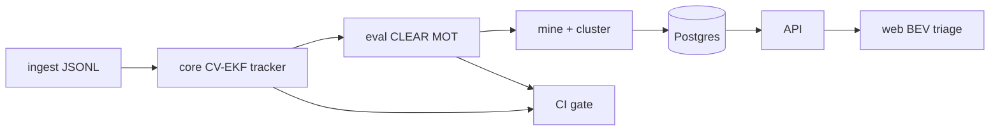

# Architecture

End-to-end loop: normalize logged scenes, run a deterministic tracker, evaluate and mine failures, store triage state, and gate CI on regressions.

## Components

### ingest

`ingest/` — nuScenes mini (+ Megvii detections) → per-scene ego-frame JSONL (`detections.jsonl`, `gt.jsonl`, `scene_meta.json`). Ego motion compensation lives here so the C++ hot path stays simple. `--synthetic` writes a tiny offline fixture for demo/CI without the 4 GB download. See [data.md](data.md).

### core

`core/` — C++17 constant-velocity EKF multi-object tracker. Hungarian association (Mahalanobis + soft lateral velocity cost), track lifecycle (tentative → confirmed → coast → dead), deterministic I/O. Emits `tracks.jsonl` and per-frame `timing.json` via `trackbench_run --timing`.

### eval / mine / cluster

`eval/` — CLEAR MOT (MOTA, IDS, FP, FN), failure mining (`ID_SWITCH`, `LATE_INIT`, …), rule-based clustering, and the CI regression gate (`eval.gate` vs `baselines/baseline.json`).

### Postgres

Prisma schema under `api/`. Stores runs, scenes, failure events, and clusters for the triage UI. Local: `docker compose up -d` + `make migrate`.

### API

`api/` — Express + Prisma. Serves runs/clusters/scene payloads; `/demo/bootstrap` loads the synthetic demo bundle into Postgres.

### web BEV

`web/` — React triage UI + Canvas 2D bird’s-eye player. Browse runs → clusters → scene playback (GT vs tracks). Screenshots live in the PR; no GIF in-repo yet.

### CI gate

`.github/` + `eval.gate` — metric floor on the synthetic fixture (MOTA / IDS; optional p99 latency when both sides have numbers). Blocks merges that regress the checked-in baseline.

## Data flow (one scene)

1. Ingest writes ego-frame JSONL under `data/normalized/<scene>/` (or fixtures).
2. `trackbench_run` reads dets + config → tracks + `timing.json`.
3. `eval.run_eval` compares tracks to GT, optionally `--mine`s failures and clusters.
4. API persists a run; web plays BEV and surfaces cluster links.
5. CI re-runs tracker + gate on the synthetic golden path.

## Related

- Locked choices: [decisions.md](decisions.md)
- First real finding: [findings/001-dense-id-switch-velocity-gate.md](findings/001-dense-id-switch-velocity-gate.md)
